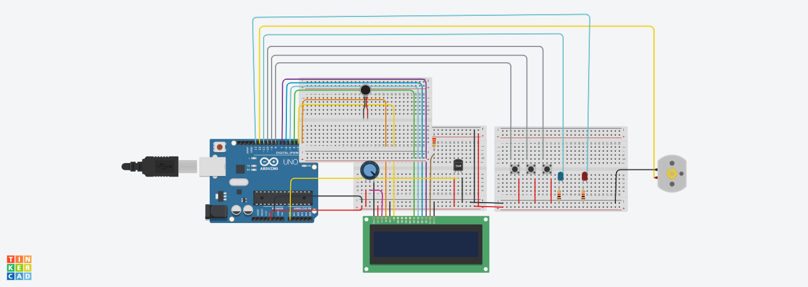

# AVR Incubator Control System

This project implements a temperature control system for an incubator using an AVR microcontroller. The system includes an LCD display for temperature monitoring and three buttons for temperature adjustment.

## Dependecies

This project depends on the following AVR libraries:

- `avr/io.h`: Provides access to AVR I/O registers for controlling ports and pins.
- `util/delay.h`: Provides delay functions for creating time delays.

## Pin Configuration
The following pin configuration is used in the project:

- `LCD_DDR`: DDR register of the LCD port.
- `LCD_PORT`: PORT register of the LCD port.
- `RS`: LCD register select pin.
- `EN`: LCD enable pin.
- `D4`: LCD data pin 4.
- `D5`: LCD data pin 5.
- `D6`: LCD data pin 6.
- `D7`: LCD data pin 7.

## Functions
1.  `void lcd_init(void)`
    This function initializes the LCD display by sending the required initialization commands.

2. `void lcd_command(unsigned char cmnd)`
    This function sends a command to the LCD display.

3. `void lcd_data(unsigned char data)`
    This function sends data to be displayed on the LCD.

4. `void lcd_print(char* str, uint8_t row)`
    This function prints a string on the LCD display at the specified row.

5. `void lcd_write_at(char* str, uint8_t row, uint8_t col)`
    This function writes a string at the specified row and column on the LCD display.

6. `void adc_init(void)`
    This function initializes the ADC (Analog-to-Digital Converter) for temperature measurement.

7. `uint16_t read_adc(uint8_t channel)`
    This function reads the ADC value from the specified channel.

8. `char* int_to_str(int value)`
    This function converts an integer value to a string.

9. `int read_up_button(void)`
    This function reads the state of the up button and returns the button value.

10. `int read_set_button(void)`
    This function reads the state of the set button and returns the button value.

11. `int read_down_button(void)`
    This function reads the state of the down button and returns the button value.

12. `int main(void)`
    The main function initializes the ADC, LCD, and other necessary components. It continuously reads the temperature using the ADC, displays it on the LCD, and controls the incubator based on the temperature and button inputs.

## Usage
Include the required AVR libraries: **avr/io.h** and **util/delay.h.**
Set up the pin configuration according to your hardware.
Call the main function to start the incubator control system.

### Note
This readme assumes that you are familiar with AVR microcontrollers, the AVR-GCC compiler, and the AVR development environment. It is important to understand the pin configurations and adapt them to your specific hardware setup.

Please refer to the AVR documentation and datasheets for more information about the specific registers and functions used in this project.

